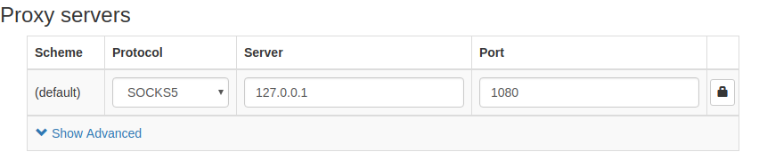
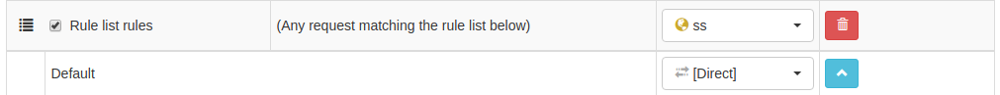
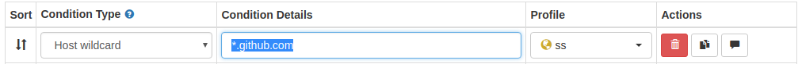
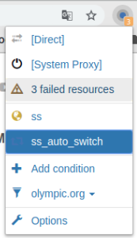
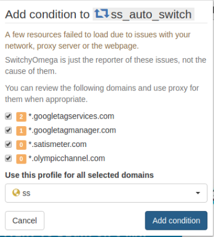
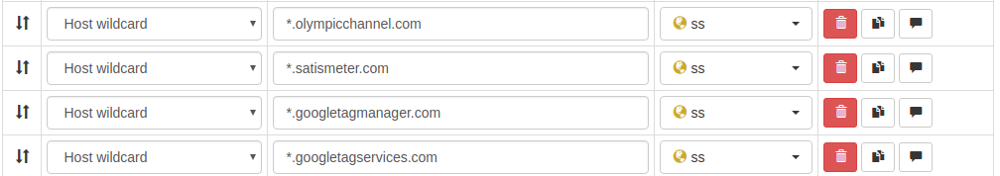
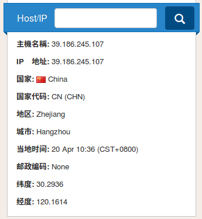

# SwitchyOmega代理设置

之前进行浏览器代理设置时只是简单的添加了代理服务器，并没有添加代理规则实现自动切换国内国外网站

参考[用SwitchyOmega管理代理设置](https://www.flyzy2005.com/tech/switchyomega-proxy-server/)进行自动切换代理设置

## 安装

`github`下载地址：[FelisCatus/SwitchyOmega](https://github.com/FelisCatus/SwitchyOmega/releases)

`csdn`下载地址：[switchyomega](https://download.csdn.net/download/u012005313/11130734)

安装步骤参考[SwitchyOmega 安装](./Ubuntu代理配置.md)

## 配置

### 删除已配置模式

安装完成后默认已设置好两个情景模式：`auto switch`和`proxy`，可以删除它们，删除顺序为`auto switch->proxy`

### 添加代理服务器

新建一个情景模式`New Profile`，选择类型为`Proxy Profile`(代理服务器)，命名为`ss`

在`Proxy Servers`中选择`Protocol`为`SOCKS5`，`Server`为`127.0.0.1`，`Port`为`1080`，最后点击左下角的`Apply Changes`



### 添加自动切换模式

再次新建一个`New Profile`，选择类型为`Switch Profile`，命名为`ss_auto_switch`

#### 规则列表设置

首先配置`Rule List Config`，选择`Rule List Format`为`AutoProxy`，在`Rule List URL`中填入规则列表

```
https://raw.githubusercontent.com/gfwlist/gfwlist/master/gfwlist.txt
```

点击`Download Profile Now`，里面包含了许多国外网址

其次配置`Switch Rules`，对于类型`Rule list rules`，选择`Profile`为`ss`（就是刚才配置的代理服务器），选择类型`Default`为`Direct`（直连，不经过代理服务器）



*其操作规则就是符合下面规则列表中的网址都经过代理服务器*

#### 情景模式设置

规则列表中没有包含全部的国外网站，还可以单独设置情景模式

在`Switch rules`中点击`Add condition`添加一行，在`Condition Details`中添加想要切换的网址，比如`*.github.com`，在`Profile`中选择`ss`，这样符合条件的网址会通过代理服务器进行连接



也可以在实际操作中添加切换情景，点击`SwitchyOmega`图标，选择`failed resources->add condition`，即可将这些网址添加到情景模式中







## ip查询

使用[https://www.geoiptool.com/zh/](https://www.geoiptool.com/zh/)或者[http://ip111.cn/](http://ip111.cn/)查询我的`ip`地址

当我直连时，使用的是杭州的`ip`；当我使用代理服务器时，使用的是美国的`ip`



