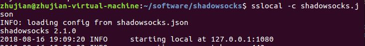
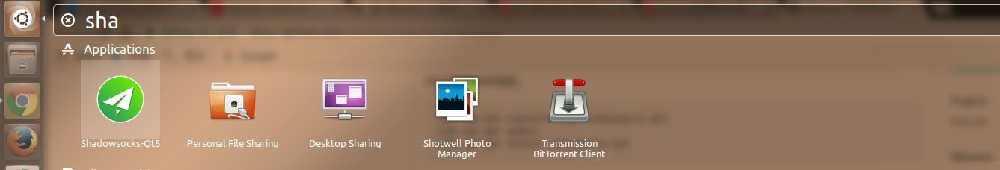
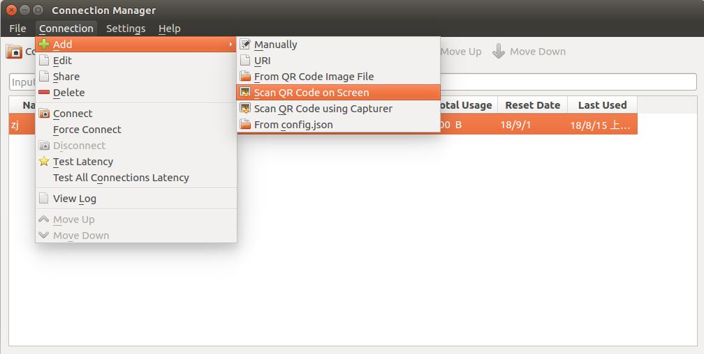
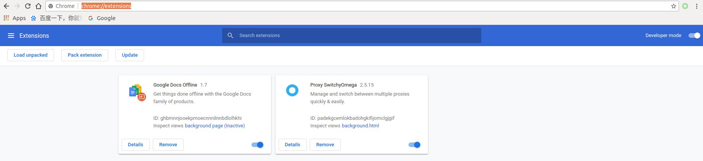
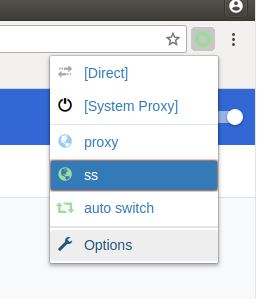
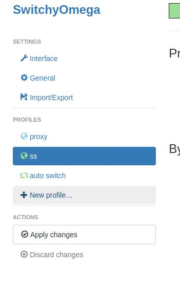
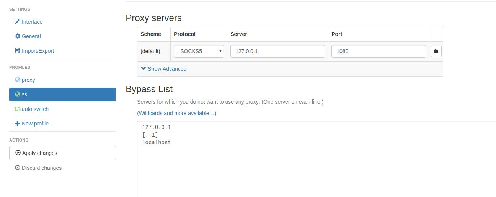
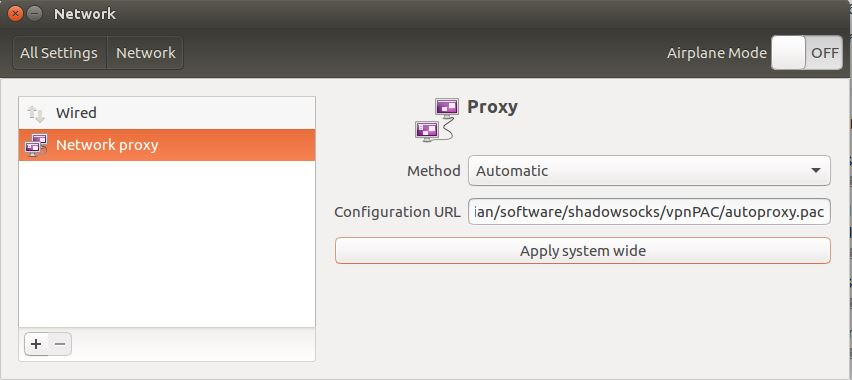

# Ubuntu代理配置

目前用的 `VPN` 是[影梭](http://vip.hao-ssr.com)，发现它没有对应的 `Linux` 使用教程

在网上找了一些资料，有多种方式可以实现翻墙，记录一下

---

主要内容：

1. <a id="T1" href="#C1" target="_self">`Shadowsocks` 安装和配置</a>
2. <a id="T2" href="#C2" target="_self">`Chrome` 代理配置</a>
3. <a id="T3" href="#C3" target="_self">全局代理配置</a>
4. <a id="T4" href="#C4" target="_self">相关</a>

---

## <a id="C1" href="#T1" target="_self">`Shadowsocks` 安装和配置</a>

`Shadowsocks` 可以通过命令行设置，也可以通过图形界面设置

仅仅通过设置 `Shadowsocks` 还不能连接外网，还需要在浏览器（以 `Chrome` 为例）上设置代理或者设置全局代理

官方 `wiki`：[shadowsocks/shadowsocks-qt5](https://github.com/shadowsocks/shadowsocks-qt5/wiki/%E4%BD%BF%E7%94%A8%E6%89%8B%E5%86%8C)

### 命令行安装和配置

参考：[Linux下使用shadowsocks（以ubuntu16.04为例，非服务器）](https://blog.csdn.net/superbfly/article/details/54950451)

`github` 上面还有好多不同版本的 `shadowsocks`，比如 [shadowsocks-go](https://github.com/shadowsocks/shadowsocks-go)

安装：

    sudo apt-get install shadowsocks

安装完成后可以使用命令 `sslocal`

    zhujian@zhujian-virtual-machine:~$ sslocal -h
    usage: sslocal [-h] -s SERVER_ADDR [-p SERVER_PORT]
                   [-b LOCAL_ADDR] [-l LOCAL_PORT] -k PASSWORD [-m METHOD]
                   [-t TIMEOUT] [-c CONFIG] [--fast-open] [-v] [-q]
    
    optional arguments:
      -h, --help            show this help message and exit
      -s SERVER_ADDR        server address
      -p SERVER_PORT        server port, default: 8388
      -b LOCAL_ADDR         local binding address, default: 127.0.0.1
      -l LOCAL_PORT         local port, default: 1080
      -k PASSWORD           password
      -m METHOD             encryption method, default: aes-256-cfb
      -t TIMEOUT            timeout in seconds, default: 300
      -c CONFIG             path to config file
      --fast-open           use TCP_FASTOPEN, requires Linux 3.7+
      -v, -vv               verbose mode
      -q, -qq               quiet mode, only show warnings/errors
    
    Online help: <https://github.com/clowwindy/shadowsocks>

可以通过命令行的方式配置，也可以通过配置文件的方式进行

主要修改 `server`, `server_port` 和 `password`

配置代理文件 `shadowsocks.json`

    {
        "server":"服务器的ip",
        "server_port":服务器的端口,
        "local_address":"127.0.0.1",
        "local_port":1080,
        "password":"密码",
        "timeout":300,
        "method":"aes-256-cfb",
        "fast_open":true
    } 

配置文件方式启动代理:

    sslocal -c shadowsocks.json

### 客户端安装和配置

参考：[Ubuntu下实现全局翻墙的配置过程](https://github.com/naseeihity/LearnToLearn/issues/7)

安装:

    sudo add-apt-repository ppa:hzwhuang/ss-qt5
    sudo apt-get update
    sudo apt-get install shadowsocks-qt5

安装完成后可以在搜索栏中打开 `Shadowsocks`

可以通过扫描二维码的方式获取 `VPN` 配置

创建代理后点击连接即可

---

## <a id="C2" href="#T2" target="_self">`Chrome` 代理配置</a>

启动 `Shadowsocks` 代理后，还需要在浏览器（以 `Chrome` 为例）上进行代理设置，利用插件 `SwitchyOmega` 实现

### `SwitchyOmega` 安装

参考：[为 Chrome 配置 Shadowsocks 代理](https://vpnto.net/posts/chrome-shadowsocks/)

国内下载网站：[Proxy SwitchyOmega](https://www.switchyomega.com/)

下载插件后，打开 `Chrome` 浏览器，搜索栏中输入 `chrome://extensions/` 进入插件管理页面

直接将插件拖拽到该页面即可自动安装 

**问题：插件无法安装**

参考：

[ubuntu 16.04 chrome无法拖拽安装crx插件](https://blog.csdn.net/xiongyangg/article/details/80550373)

[linux下怎么用命令行开启chrome?还有就是常见的安装软件linux下安装在哪儿？](https://www.zhihu.com/question/20533784)

如果上述方式无法安装插件，通过命令行启动 `Chrome`

    google-chrome --enable-easy-off-store-extension-install

重复上述操作即可

### SwitchyOmega 代理

安装完成后，搜索栏旁边出现图标

点击该图标 `-> Options`，打开设置页面

点击左侧 `New profile` 选项，新建配置文件

输入配置文件名（*随意，比如 `ss`*），默认选择 `Proxy Profile`，点击 `Create`
`

然后在新创建的配置文件中选择 `Protocol -> SOCKS5`，输入 `Server -> 127.0.0.1`，输入 `Port -> 1080`，点击左下角的 `Apply Changes`

完成上述操作后，点击 `SwitchyOmega` 图标，选择刚才创建的配置文件 `ss`，即可访问外网

---

## <a id="C3" href="#T3" target="_self">全局代理配置</a>

参考：

[ubuntu基于shadowsocks的PAC全局代理：解决方案](https://blog.csdn.net/hanshileiai/article/details/52624303)

[ubuntu下 shadowsocks（VPN）配置全局可用](https://blog.csdn.net/reallocing1/article/details/52262281)

[JinnLynn/genpac](https://github.com/JinnLynn/genpac/blob/master/README.md)

安装 `GenPAC`:

    pip install genpac

生成本地 `pac` 文件

    genpac --format=pac --pac-proxy="SOCKS5 127.0.0.1:1080" --output="autoproxy.pac"

打开系统设置 `->` 网络 `->` 网络代理

`Method` 选项选择 `Automatic`，`Configuration URL` 输入本地文件
    
    file:///you_path/autoproxy.pac

点击 `Apply system wide` 即可实现全局代理

### `ProxyChains`

设置完成全局代理后，在终端仍旧会出现无法连接的情况，需要进一步设置代理，可以使用工具 `proxychains` 或者 `polipo`

以 `proxychains` 为例

安装：

    sudo apt-get install proxychains

修改配置文件 `/etc/proxychains.conf`

    #socks4 	127.0.0.1 9050
    socks5 127.0.0.1 1080

重启应用
    
    sudo /etc/init.d/proxychains restart

打开命令行窗口，在输入命令的前面增加 `proxychains` 即可

    proxychains curl www.google.com

**问题：`proxychains ping www.google.com` 出错**
    
    ProxyChains-3.1 (http://proxychains.sf.net)
    ERROR: ld.so: object 'libproxychains.so.3' from LD_PRELOAD cannot be preloaded (cannot open shared object file): ignored.
    PING www.google.com (74.86.17.48) 56(84) bytes of data.

参考：

[proxychains-ld-preload-cannot-be-preloaded](https://askubuntu.com/questions/293649/proxychains-ld-preload-cannot-be-preloaded)

[Is ping not supposed to work via proxychains?](https://superuser.com/questions/442995/is-ping-not-supposed-to-work-via-proxychains)

这里面共有两个问题，第一个问题：没有预加载 `libproxychains.so.3`

查找：

    locate libproxychains.so.3

    /usr/lib/x86_64-linux-gnu/libproxychains.so.3
    /usr/lib/x86_64-linux-gnu/libproxychains.so.3.0.0

可以修改预加载文件 `/usr/bin/proxychains`

    cat /usr/bin/proxychains

    #!/bin/sh
    echo "ProxyChains-3.1 (http://proxychains.sf.net)"
    if [ $# = 0 ] ; then
    	echo "	usage:"
    	echo "		proxychains <prog> [args]"
    	exit
    fi
    export LD_PRELOAD=libproxychains.so.3
    exec "$@"

或者自己添加到环境变量

    export LD_PRELOAD=/usr/lib/x86_64-linux-gnu/libproxychains.so.3

第二个问题：`proxychains` 对 `ping` 没用

参考：[Is ping not supposed to work via proxychains?](https://superuser.com/questions/442995/is-ping-not-supposed-to-work-via-proxychains)

`proxychains` 使用的协议和 `ping` 使用的协议不同

---

## <a id="C4" href="#T4" target="_self">相关</a>

[ShadowsocksR](https://plus.google.com/communities/117390969460066916686)

[Linux 配置SSR 客户端](https://www.jianshu.com/p/c336fd0bdfbe)

[在 Ubuntu 上使用 SSR 梯子](https://alanlee.fun/2018/05/18/ubuntu-ssr/)

[4 - Ubuntu 16.04 + SSR翻墙](https://www.jianshu.com/p/a0f3268bfa33)

