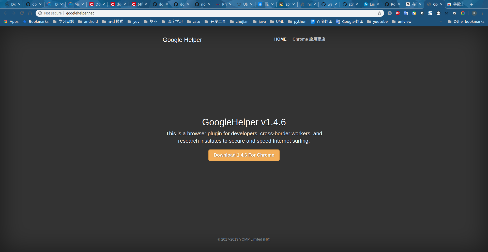
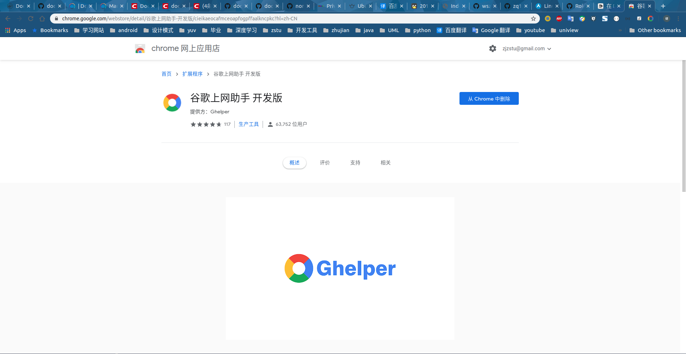
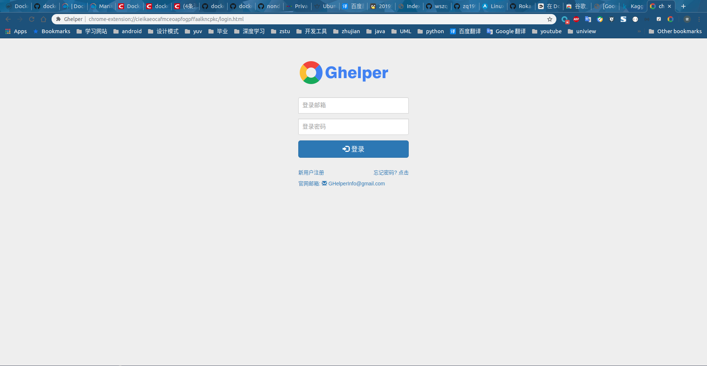
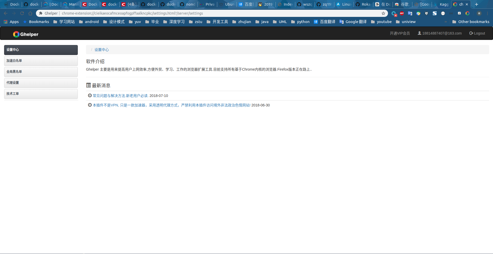

# [Google Helper]辅助搜索工具

最近一段时间梯子限速很严重，听朋友介绍了一个`Chrome`插件`Google Helper`，能够在没有梯子的情况下进行`Google`搜索

## 概述

官网地址：[Google Helper](http://googlehelper.net/)

其介绍如下：

> 专门为科研、外贸、跨境电商、海淘人员、开发人员服务的上网加速工具，chrome内核浏览器专用!可以解决chrome扩展无法自动更新的问题，同时可>以访问谷歌google搜索，gmail邮箱，google+等谷歌产品

## 安装

有两种方式进行安装：

1. 下载安装包
2. `Google`应用商店（推荐）

官方推荐第二种，这样能够保证版本正常升级，如果没有外网的话选择第一种方式

## 体验

安装完成后在插件栏会出现以下图标

需要点击登录账户

首次登录会有`3`天的`VIP`体验，这时候就可以使用`Google`搜索了，除了一些指定网站不能打开（比如`YOUTUBE/FACEBOOK`等），其他一些国外的学习网站（比如`KAGGLE`）都可以打开

之后的使用可以点击左侧`加速白名单`，可以选择`设置代理`（之前有的话）或者`购买VIP会员`（就是官方的代理）

*使用`Chrome Helper`会关闭其他代理软件，比如`SwitchyOmega`*