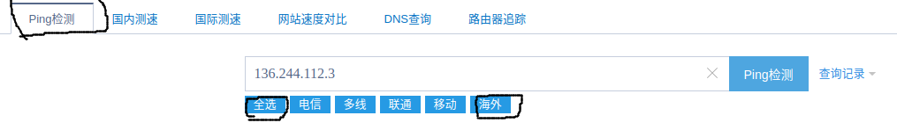
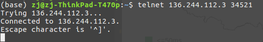
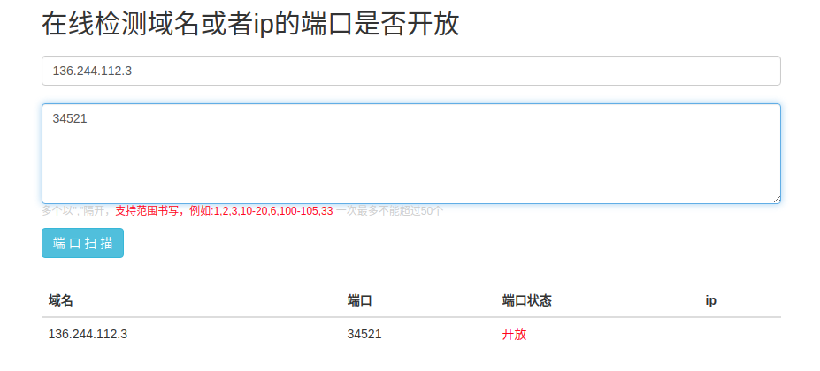
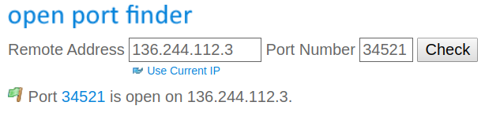

# 如何判断ip或端口被封

参考：

[如何检查搬瓦工的IP是否被封](https://www.bandwagonhost.net/769.html)

[搬瓦工能ping通,ssh不能连接,ss打不开网页](https://www.liuchang.org/ban-wa-gong-neng-ping-tongssh-bu-neng-lian-jiess-da-bu-kai-wang-ye/)

[解决ss突然无法联网](http://www.pianshen.com/article/6552251764/)

这一段时间经常无法连接外网，最常遇到的两个问题是

1. `ping ip`不成功
2. `ping ip`成功但是浏览器无法连接外网

在网上找了很久资料，终于对`IP`或端口被封有了一些理解

## IP检测

### 命令行方式

最简单的是在命令行窗口上测试

```
$ ping 136.244.112.3
PING 136.244.112.3 (136.244.112.3) 56(84) bytes of data.
64 bytes from 136.244.112.3: icmp_seq=1 ttl=46 time=240 ms
64 bytes from 136.244.112.3: icmp_seq=2 ttl=46 time=240 ms
64 bytes from 136.244.112.3: icmp_seq=3 ttl=46 time=242 ms
64 bytes from 136.244.112.3: icmp_seq=4 ttl=46 time=239 ms
^C
--- 136.244.112.3 ping statistics ---
4 packets transmitted, 4 received, 0% packet loss, time 3003ms
rtt min/avg/max/mdev = 239.683/240.601/242.435/1.078 ms
```

### 在线方式

也可使用网站[Ping检测](http://ping.chinaz.com/)进行测试



**注意：可单独测试海外连通性**

除了给出响应数据之外，还会以图的形式显示

对于`www.google.com`


对于`www.vultr.com`


### 判断

* 如果国内和国外都`ping`不通，则是海外服务器的问题
* 如果国内`ping`不通，国外能`ping`通，那么`IP`被封了

## 端口检测

### 命令行方式

参考：[如何ping指定IP的端口号](https://www.jianshu.com/p/fbdf744a3fbd)

使用`telnet`命令测试端口：

```
$ telnet ip port
```

如果成功会建立一条`TCP`连接；如果失败（可能是`IP`，也可能使端口）立即退出



### 在线方式

使用国内网站测试`ssr`服务器端口是否连通：[在线检测域名或者ip的端口是否开放](http://coolaf.com/tool/port)



使用国外网站测试`ssr`服务器端口是否连通：[Port Forwarding Tester](https://www.yougetsignal.com/tools/open-ports/)



### 判断

* 如果国内和国外都不能连通，是服务器问题
* 如果国内不能连通，国外能连通，那么端口被封了

## 解决方式

* 对于`IP`被封，需要重新更换`IP`
* 对于端口被封，需要重新设置`ssr`服务器端口号

重新更新客户端配置时，会出现**`1080`端口被占用**的提示，最好先杀死原先的客户端进程，再重新启动

```
# 查询占用1080端口的进程
$ sudo netstat -lnp | grep 1080
# 杀死进程
$ sudo kill xxx
# 重启ssr客户端
$ electron-ssr
```