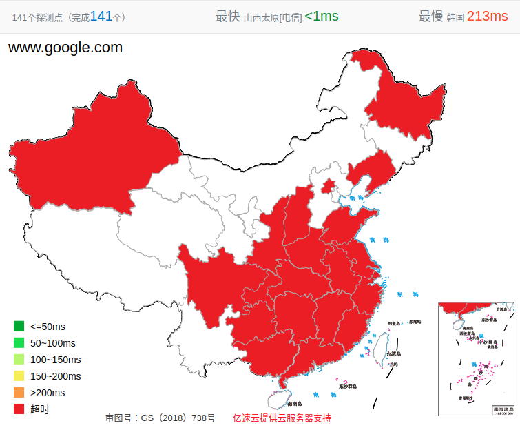
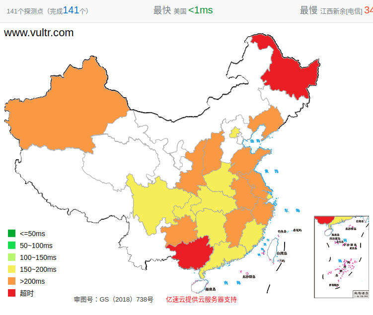

# 如何判断端口被封

参考：

[如何检查网站（域名或ip）是否被墙](https://allinfa.com/domain-ip-gfw.html)

[2018 最新检查搬瓦工 IP / 端口是否被封的方法](https://www.bandwagonhost.net/1934.html)

## 在线网站

登录国外检测墙的网站[Website Test behind the Great Firewall of China](https://www.websitepulse.com/tools/china-firewall-test#)，输入网址进行测试，可以选择`4`个国内的节点(`Shanghai、Beijing、Guangzhou、Hong Kong`)进行测试

    # 对于www.google.com
    Status:	Connection timed out
    # 对于www.vultr.com
    Status:	OK

或者使用国内的网站[Ping 检测](http://ping.chinaz.com/www.google.com)

他除了给出响应数据之外，还会以图的形式显示

对于`www.google.com`

对于`www.vultr.com`

## 命令行

可以使用`ping`命令进行简单测试，对于`windows`用户，还可以使用`tracert`进行路由追踪