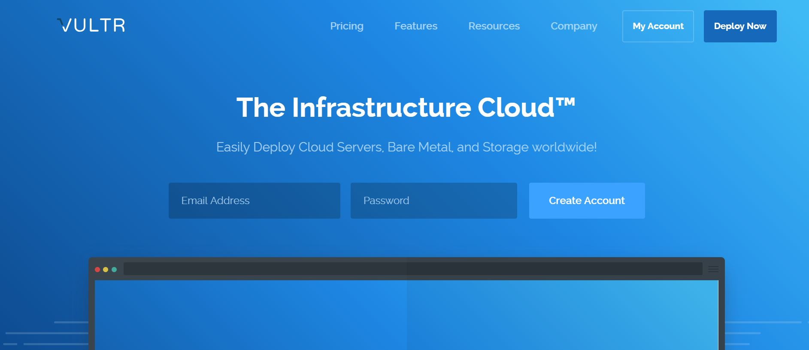
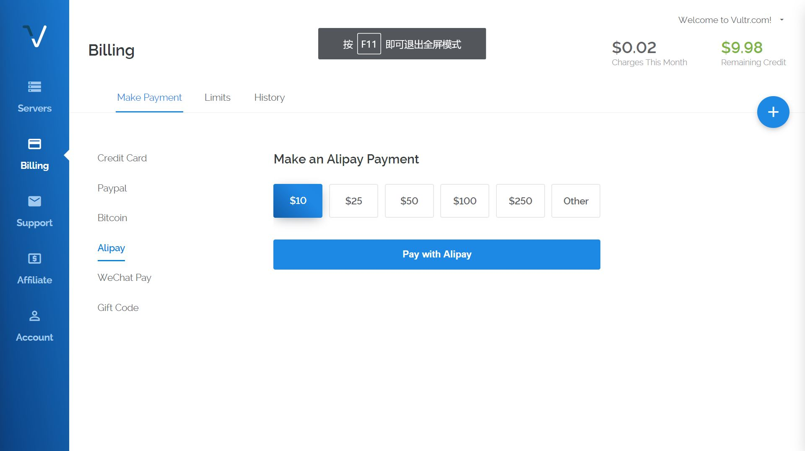
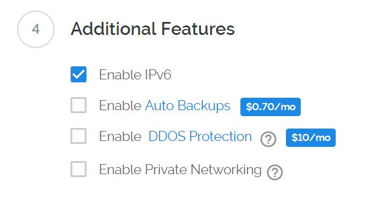
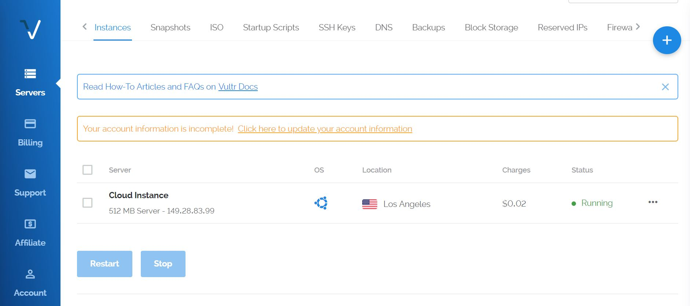
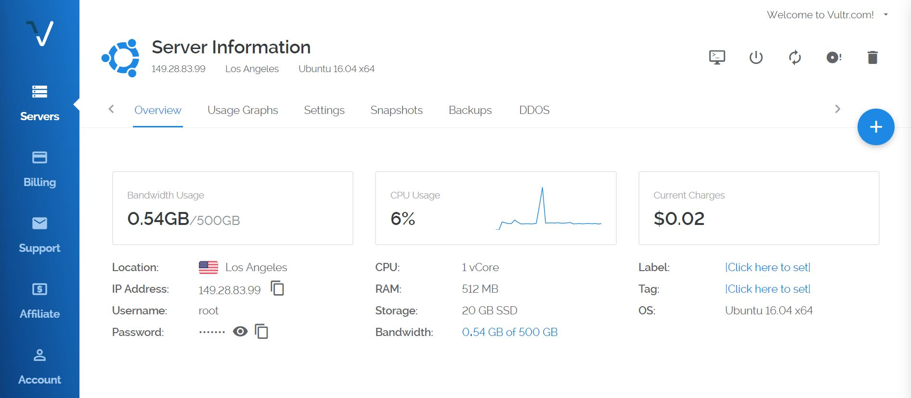
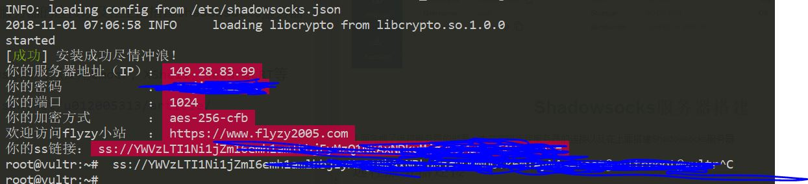

# 手动翻墙

之前使用过很多个付费翻墙软件，最终都因为线路不稳定而放弃。最近一个是影梭，用了`4`个月还不错，今天让我重新续费，没想到再付了`3`个月的费用后无法使用新的线路

在网上找到手动翻墙的文章，尝试一下：

[手把手教你搭建shadowsocks科学上网 搭建ss翻墙](https://www.textarea.com/shadowsocks/shoubashou-jiao-ni-dajian-shadowsocks-kexue-shangwang-dajian-ss-fanqiang-935/)

整个过程就是购买国外服务器，在上面搭建`Shadowsocks`服务器，然后在本地搭建`Shadowsocks`客户端以及浏览器配置

翻墙网站实现了前两步，所以在上面注册购买服务后只需在本地进行操作即可。

---

目录

1. <a id="T1" href="#C1" target="_self">`VPS`服务器部署</a>
2. <a id="T2" href="#C2" target="_self">Shadowsocks服务器搭建</a> 
3. <a id="T3" href="#C3" target="_self">Shadowsocks客户端&浏览器配置</a> 

---

## <a id="C1" href="#T1" target="_self">`VPS`服务器部署</a>

国外的`VPS`（虚拟专用服务器，`Virtual Private Server`）服务商有`linode`，`VULTR`，`DigitalOcean`等，我参考文章选择`VULTR`

[https://www.vultr.com/](https://www.vultr.com/)

`VULTR`支持支付宝和微信支付，按小时计费

    How am I billed for my instances?
    All servers on your account are billed hourly up to the monthly rate cap. The hourly rate is determined by dividing the monthly rate by 672 hours (28 days). If your server is online for more than 672 hours in a calendar month, you will only be billed the monthly rate. Accumulated charges are invoiced to your account on the 1st of every month.

    你账户上的所有服务器都按小时费率计费。每小时费率由每月672小时（28天）除以。如果您的服务器在日历月上线超过672小时，您将只计入月度费率。累积费用在每月第一天的账单上开具。
    
    What payment methods do you accept?
    We accept Visa, Mastercard, American Express, Discover, JCB, Bitcoin (BTC and BCH), Alipay, UnionPay, WeChat Pay, and PayPal. Depending on your geographic region, Paypal supports additional payment networks, including Giropay and bank transfers.

有一个中文相关网站：[https://www.vultryhw.com/](https://www.vultryhw.com/)

### 注册账户

打开网站，输入邮箱和密码，点击 `Create Account`，然后在邮箱中确认即可

### 充值

注册完成进入个人页面后，点击左侧`Billing`选项，选择`Alipay`，先充值最少的`$10`

### 部署服务器

点击右上角的加号图标

选择服务器位置（`Server Location`），服务器类型（`Server Type`）以及服务器配置（`Server Size`）

个人配置：

    Server Location: Los Angeles(United States)
    Server Type: Ubuntu 16.04 x64
    Serve Size: 20GB SSD $3.50/mo $0.005/h

当时冲了`$10`花了`70.7`元人民币，`$3.50=￥24.745`

额外配置的话选择`Enable IPv6`

点击`Deploy Now`，一个服务器即配置完成并开始部署

点击该服务器，即可查看相应的`ip`，用户名和密码

---

## <a id="C2" href="#T2" target="_self">`Shadowsocks`服务器搭建</a>

上面完成了远程服务器的部署，本节实现远程服务器的连接以及在上面搭建`Shadowsocks`服务器

### 远程服务器连接

在本地打开命令行窗口进行`ssh`连接，`Windows`系统可以使用`Cmder`，`XShell`，`SecureCRT`等

参考：[Windows cmder](https://blog.csdn.net/u012005313/article/details/80272721)

连接远程服务器

    ssh root@服务器ip

### `Shadowsocks`服务器搭建

使用一个脚本进行一键安装

    git clone https://github.com/Flyzy2005/ss-fly

    ss-fly/ss-fly.sh -i password 1024

将`password`替换成自定义的密码，`1024`表示端口号（默认为`1024`，可以更改）

搭建成功后会提示

*将该命令加入到启动文件`/etc/profile`实现开机自启动*

---

## <a id="C3" href="#T3" target="_self">`Shadowsocks`客户端&浏览器配置</a>

接下来的操作就和之前一样了，参考

[Shadowsocks - Clients](https://shadowsocks.org/en/download/clients.html)

[Proxy SwitchyOmega](https://www.switchyomega.com/)